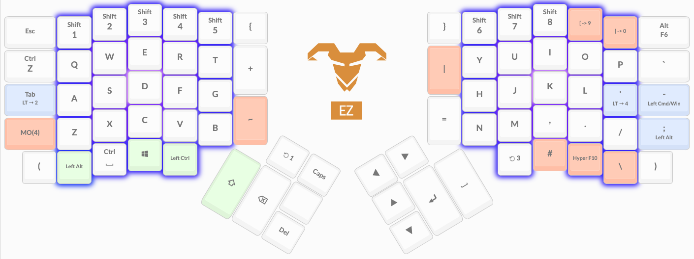
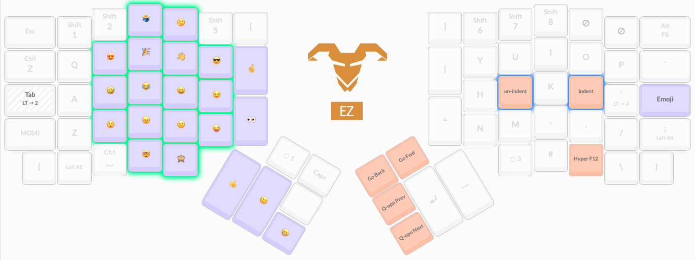
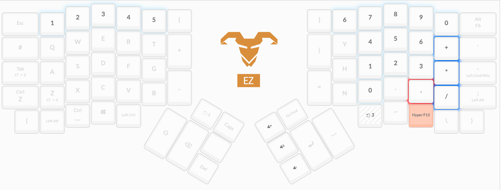
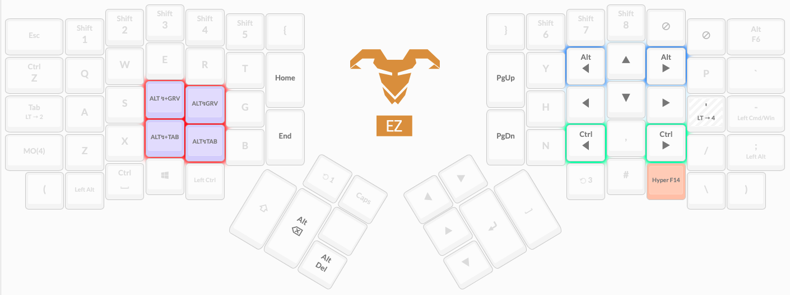

# @stoneman's Ergodox EZ layout

## Introduction

This repository is a fork of [qmk_firmware](https://github.com/qmk/qmk_firmware) containing my layout for the [Ergodox EZ](https://ergodox-ez.com/).

The source for my layout can be found within: [keyboards/ergodox_ez/keymaps/stoneman/](keyboards/ergodox_ez/keymaps/stoneman/)

## Building from source

- Perform the steps described in sections `1. Download Software` and `2. Prepare Your Build Environment` of https://docs.qmk.fm/#/newbs_getting_started.
- Execute `qmk setup -H $QMK_FIRMWARE_HOME stoneman/qmk_firmware` where `$QMK_FIRMWARE_HOME` is where this repository is cloned, or where you want it to be.
- Get the latest version of Wally from https://github.com/zsa/wally/releases and install `wally-cli`.
- Execute `./flash_stoneman.sh` - once built it will prompt for you to flash your keyboard but this can be cancelled.

## About the layout

### General

  - The three indicator LEDs on the right keypad have been disabled (too bright in a dark room).
  - I use my ergodox (via a KVM) with both a Mac and a PC and I want a British keyboard layout on both machines. For this to work well I have:
      - Windows set to `ENG UK` keyboard layout
      - MacOS set to `British PC` keyboard layout
      - In my QMK layout, I assign `Non-US \` and `Non-US #` to keys instead of `\` and `#`.
      - Use [Karabiner-Elements](https://karabiner-elements.pqrs.org/) on the Mac to translate:
          - `non_us_backslash` to ``grave_accent_and_tilde (`)``
          - ``grave_accent_and_tilde (`)`` to `non_us_backslash`
          - `left_command` to `left_control`
          - `left_control` to `left_command`
  - [`Raw HID`](https://docs.qmk.fm/#/feature_rawhid) is used by my [Mac Daemon](https://github.com/stoneman/micmon) to set RGB key animation when [Zoom](https://zoom.us/) is running to remind me to position/switch on my mic.
      
### Layer 0 - Main

A general use layer with a focus on coding.

Key LEDs are a light purple in the center of the key pads fading out to a cool blue at the edges 💎

 - `Alt+F6` is `Mute Mic` for Zoom on the Mac and [Discord](https://discordapp.com/) on the PC.
 - When holding `; / Left Alt`, `Alt+F6` becomes the `Layer 5` key.
 - The top row numbers are "shifted" by default, except for the keys in position `9` and `0` which are `[` and `]`. When `Shift` is held, the top row numbers revert to their digit values.
 - The `ALT↯TAB` and `ALT↯+TAB` keys are used for switching windows, natively on Windows and using [Alt-Tab](https://github.com/lwouis/alt-tab-macos) on the Mac.
 - Alt-Tab on the Mac also uses the `ALT↯GRV` and `ALT↯+GRV` keys to cycle through windows of the currently focused window.
 - The `Caps Lock` key delays it's release by 200ms. This is because MacOS assumes you were only joking if you tap it too quickly (seriously 🤦‍)
 - `Ctrl+Z` - Undo, it's so nice having a key for this.
 - The `Enter` key on this left hand cluster is handy when my right hand is on the mouse.
 - `Ctrl+Space` is the Mac Spotlight hotkey.
 
### Layer 1 - Func

Function keys and others that I occasionally want when Layer 0 is active.

LEDs highlight groups of keys which perform a similar function.

- I have an [ultra-wide monitor](https://www.samsung.com/uk/monitors/curved-se790c/LS34E790CNSEN/) and normally position windows side by side on the Mac (left side is just under 2/3rd of the screen wide). I use [Slate](https://github.com/jigish/slate) to quickly position windows.
     - `Shift+F18` positions the active window in the "left two thirds" position.
     - `Shift+F19` positions the active window in the "right one third" position.
     - `Shift+F20` positions all windows in the "correct" location as specified in the slate configuration file.
 - `Alt+SysReq` is "Print Screen" on Windows.
 - There are macros for `Save`, `Quit` and `Save and Quit` in Vim.
 
### Layer 2 - Emoji

Emoji and more keys that I occasionally want when Layer 0 is active.

LEDs highlight groups of keys which perform a similar function.

 - `Ctrl+Cmd+Space` is the MacOS emoji hotkey. AutoHotkey on the PC maps it to the Windows emoji hotkey (`Win+.`).
 - `Alt+Enter` saves stretching for the `Alt` and `Enter` keys with Layer 0.
 - For the Unicode input to work on both Windows and Mac, I have:
    - [WinCompose](https://github.com/samhocevar/wincompose) running on Windows.
    - The `Unicode Hex Input` keyboard layout enabled on the Mac.
    - Code which sets the Unicode format to Windows-style when the keyboard boots/resumes from sleep.
    - Code which sets the Unicode format to Mac-style whenever a Raw HID command is received.
    - Code which sends the Mac "switch to next input type" shortcut whenever the Emoji layer is enabled or disabled. Since I have only two input types, the effect is that `Unicode Hex Input` is enabled for the Emoji layer and `British - PC` is enabled for all others. 
    - Code which uses QMK's Unicode input method for Windows when Windows-style Unicode is set and which sends the relevant hex strings when Mac-style Unicode is set (I couldn't get QMK's Unicode input method for Mac to work with Unicode characters in the emoji range).

### Layer 3 - Num
 
Number, volume and arrow keys.

LEDs highlight groups of keys which perform a similar function.

 
### Layer 3 - Alt-Tab

Keys for cycling through windows and also some navigational keys.

LEDs highlight groups of keys which perform a similar function.

  - The `Alt+Left` and `Alt+Right` keys are for moving the cursor back/forward one word on the Mac. [AutoHotkey](https://www.autohotkey.com/) converts to `Ctrl+Left` and `Ctrl+Right` for the same behaviour on Windows.
  - The `Ctrl+Left` and `Ctrl+Right` keys are for moving the cursor to the start/end of the line on the Mac. AutoHotkey converts to `Home` and `End` for the same behaviour on Windows.
  
### Layer 3 - Dota

This layer is just for playing [Dota](http://www.dota2.com).

LEDs are a bright yellow in the center of the key pads fading out to a bright red at the edges. 🔥🔥🔥

 - `Alt`, `Shift` and `Ctrl` where I want them when playing.
 - Lots of F-keys so that those keys to be configured as hotkeys in Dota.
 - Volume controls are accessible in this layer.
 - There are `Del` and `Backspace` keys since the Layer 0 thumb cluster keys are obscured by dota keybindings.

Otherwise, as few changes as possible from Layer 0 so that I can type reasonably normally when chatting in-game.

Functions bound in Dota (`Alt` values in brackets):

